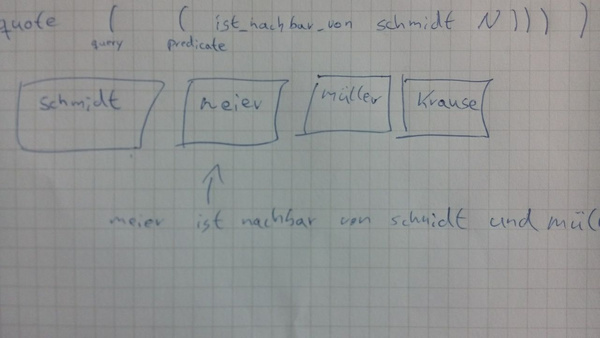

# SFBeleg
Belegaufgabe für das Fach Software Factories

Hier die manuelle Code Transpilierung (bereits mit Jamus scheme getestet)
```
(prolog (quote (((ist_nachbar_von schmidt meier))
((ist_nachbar_von meier mueller))
((ist_nachbar_von mueller krause))))
(quote ( (ist_nachbar_von schmidt N)(ist_nachbar_von N mueller) ) ))
 ]
```
die Antwort lautet:
```
N = meier
```

